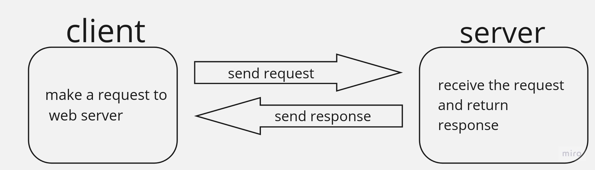
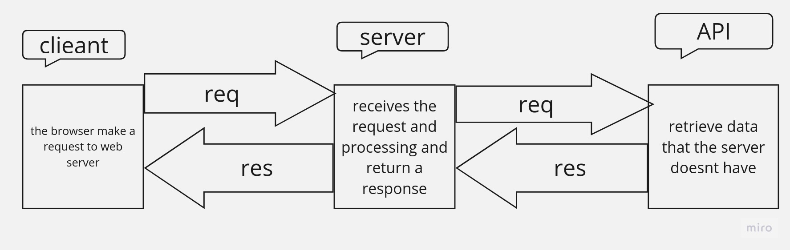

# movies-library - 0.1

**Author Name**: Anas Nemrawi

## WRRC

## Overview
movie app that can check the latest movies based on categories.
## Getting Started
first should be import the express frameWork & cors , then you should store the all method then create a constructor function to ensure your data follow the same format., after that you need to give a PORT to localhost and define the home route, then if you have a lot of pages you need to define them also .

## Project Features
-show the list of movies -search about specific movie -you can see what's your favorite Movies

